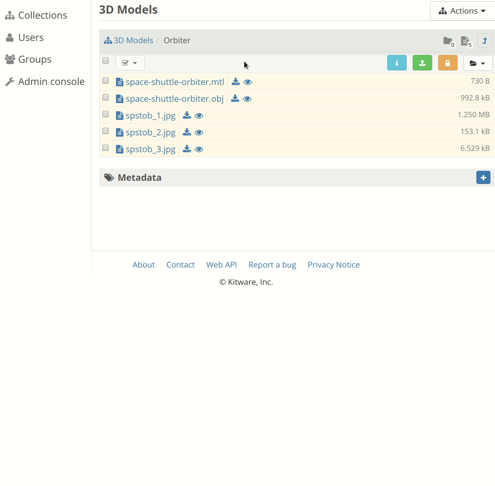

# VTK.js Viewer

[Girder](https://github.com/girder/girder/) plugin to visualize 3D models using
VTK.js.

## Requirements

- Girder 2.x

## Usage

- In the Girder web client, navigate to a folder that contains 3D models.

- To load a model, click the "View in browser" icon--the eye--next to the file
  name The 3D view appears below the list of files. The background of the icon
  turns yellow to indicate that the model is shown.

- To remove a model from the 3D view click the "View in browser" icon again. The
  yellow background of the icon disappears to indicate that the model is no
  longer shown.

## Notes

- The 3D view supports displaying multiple models simultaneously.

- Girder provides multiple ways to group related files, such as an OBJ file and
  its associated MTL and texture files. Therefore, this plugin supports loading
  models where the related files are either:
  - individual items in the same folder
  - stored in a single item

## Model formats

The plugin supports loading 3D models in the following file formats:

- [Wavefront OBJ](https://en.wikipedia.org/wiki/Wavefront_.obj_file) with MTL
  and textures.

## Demo

